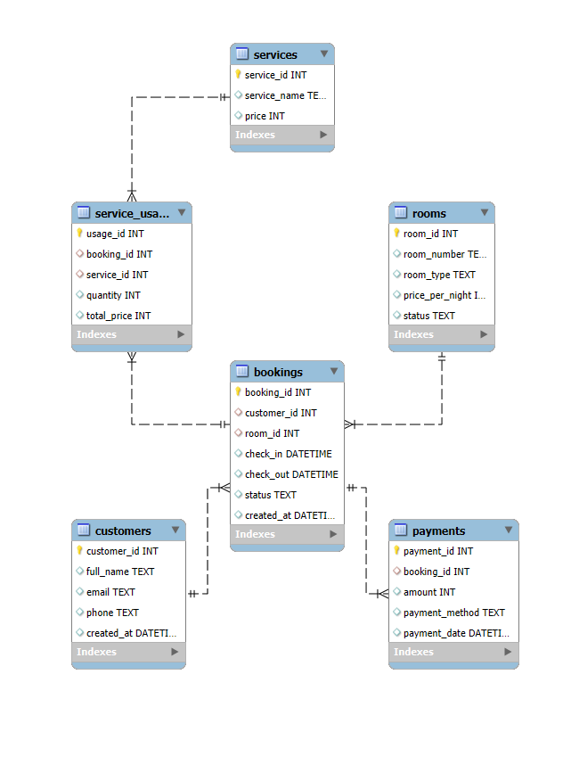

# 📊 Hotel Performance Analysis

## 🎯 Project Objective

Analyze the overall performance of a hotel over the past 2 years, focusing on four key pillars:

- Room occupancy performance  
- Revenue (from rooms and services)  
- Customer behavior  
- Service usage patterns  

## 📂 Data Structure

| Table           | Description                                      |
|-----------------|--------------------------------------------------|
| `bookings`      | Customer booking history                         |
| `rooms`         | Information about rooms in the hotel             |
| `customers`     | Customer list                                    |
| `services`      | Additional services provided by the hotel        |
| `service_usage` | Data on which services customers have used       |
| `payments`      | Customer payment transactions                    |

## 📌 Entity Relationship Diagram (ERD)

The diagram below illustrates the relationships between tables used in this project.

## 🔍 Insights

Below are key insights drawn from the hotel’s performance analysis:

1. 🛌 **Low occupancy rates due to short stays**

- Many rooms have **less than 4% occupancy** due to most guests staying for only 1 night.
- Although bookings peaked in summer (notably 99 bookings in July 2023), the **average cancellation rate reached 51.05%**, significantly affecting real utilization.

2. 💰 **Revenue concentrated in specific rooms and services**

- **Room R228** generated the highest revenue (₫51.73M), showing strong potential for focus marketing.
- Among services, **Spa brought in the most revenue (₫312.65M)**, indicating high demand for wellness experiences.
- **Room Service** is the **most used service (824 uses)** — an opportunity to increase revenue via premium upgrades or bundling.

3. 👥 **Loyal customers are a sustainable revenue source**

- Over **1,900 returning customers**, some staying up to **10 times**, indicate strong satisfaction and potential for long-term value.
- Customers like **Customer 362, Customer 219, Customer 130** should be considered for loyalty programs or personalized offers.

4. 📉 **High booking cancellation rate is a major risk**

- **Monthly cancellation rates remain high**, reaching nearly **60% in February and April 2023**.
- Possible causes: too-flexible cancellation policy, poor user experience, or unfulfilled expectations.
- Solutions include requiring deposits, UX improvement, or faster booking confirmations.

## 💡 Recommendations

- 🛌 **Optimize rooms with short stays**: Design incentives for stays ≥2 nights or apply dynamic pricing to improve occupancy.
- 💰 **Boost revenue via service combos**: Bundle rooms with spa or dining options.
- 📆 **Reduce cancellations in peak months**: Consider deposits and streamline booking confirmation.
- 🧴 **Promote high-margin services**: Cross-sell Spa and Room Service during booking.
- 🔁 **Encourage repeat guests**: Launch loyalty programs with personalized rewards.

---

## 🎯 Mục Tiêu Dự Án

Phân tích tổng quan hiệu suất hoạt động của một khách sạn trong 2 năm gần nhất, tập trung vào 4 trụ cột chính:

- Hiệu suất đặt phòng  
- Doanh thu (từ phòng & dịch vụ)  
- Hành vi khách hàng  
- Tình hình sử dụng dịch vụ  

## 📂 Cấu Trúc Dữ Liệu

| Bảng            | Mô tả dữ liệu                                 |
|-----------------|-----------------------------------------------|
| `bookings`      | Lịch sử đặt phòng của khách hàng              |
| `rooms`         | Thông tin các phòng trong khách sạn           |
| `customers`     | Danh sách khách hàng                          |
| `services`      | Dịch vụ bổ sung mà khách sạn cung cấp         |
| `service_usage` | Dữ liệu khách đã sử dụng dịch vụ nào          |
| `payments`      | Các khoản thanh toán của khách                |

## 📌 Sơ đồ quan hệ (ERD)

Ảnh dưới đây minh họa mối quan hệ giữa các bảng dữ liệu được sử dụng trong phân tích.

## 🔍 Kết quả phân tích
Dưới đây là những kết quả nổi bật được rút ra từ việc phân tích dữ liệu khách sạn:

1. 🛌 **Tỷ lệ lấp đầy thấp do thời gian lưu trú ngắn**

- Nhiều phòng có **tỷ lệ lấp đầy dưới 4%** do phần lớn khách chỉ lưu trú qua đêm 1 ngày.
- Mặc dù số lượt đặt phòng có xu hướng tăng vào mùa hè (đỉnh điểm vào tháng 7/2023 với 99 lượt), nhưng **tỷ lệ huỷ đặt phòng trung bình lên đến 51.05%**, gây ảnh hưởng nặng nề đến công suất hoạt động thực tế.

2. 💰 **Doanh thu tập trung ở một số phòng và dịch vụ cụ thể**

- **Phòng R228** mang lại doanh thu cao nhất (51,730 triệu đồng), thể hiện rõ tiềm năng cần khai thác tiếp.
- Trong các dịch vụ, **Spa tạo ra doanh thu cao nhất với 312,650 triệu đồng**, chứng tỏ nhu cầu thư giãn và chăm sóc sức khỏe của khách hàng cao, cần đầu tư thêm về trải nghiệm dịch vụ này.
- **Room Service** tuy không phải dịch vụ có doanh thu cao nhất nhưng có **tần suất sử dụng nhiều nhất (824 lượt)** → là cơ hội để tăng doanh thu thông qua nâng cấp các dịch vụ phòng, combo hoặc phụ phí.

3. 👥 **Khách hàng trung thành là nguồn doanh thu bền vững**

- Có hơn **1.900 khách quay lại** từ 2 lần trở lên, đặc biệt có **khách quay lại đến 10 lần**, chứng minh mức độ hài lòng và tiềm năng tạo doanh thu dài hạn.
- Các khách hàng quay lại nhiều nhất như **Customer 362, Customer 219, Customer 130** nên được đưa vào nhóm khách hàng thân thiết để áp dụng chương trình chăm sóc riêng hoặc ưu đãi dài hạn.

4. 📉 **Tỷ lệ huỷ phòng cao là rủi ro lớn cho vận hành**

- **Tỷ lệ huỷ phòng hàng tháng luôn dao động ở mức cao**, có tháng lên tới gần **60% (như tháng 2 và 4/2023)**.
- Nguyên nhân có thể đến từ chính sách huỷ phòng quá linh hoạt, dịch vụ chưa đáp ứng kỳ vọng hoặc trải nghiệm đặt phòng không rõ ràng.
- Đây là lỗ hổng lớn cần được khắc phục, ví dụ bằng cách yêu cầu đặt cọc, tối ưu UX giao diện đặt phòng hoặc cải thiện quy trình xác nhận nhanh.

## 💡 Đề xuất

- 🛌 **Tối ưu hóa phòng có lưu trú ngắn hạn**: Thiết kế gói ưu đãi cho khách ở ≥2 đêm hoặc điều chỉnh giá linh hoạt để tăng tỷ lệ lấp đầy.
- 💰 **Tăng doanh thu qua combo dịch vụ**: Kết hợp phòng với Spa hoặc ăn uống để tăng giá trị đơn hàng.
- 📆 **Giảm hủy đặt phòng trong tháng cao điểm**: Xem xét chính sách cọc và cải thiện quy trình xác nhận đặt phòng.
- 🧴 **Đẩy mạnh dịch vụ có lợi nhuận cao**: Tăng nhận diện và bán chéo các dịch vụ như Spa, Room Service.
- 🔁 **Khuyến khích khách quay lại**: Áp dụng chương trình khách hàng thân thiết với ưu đãi cá nhân hóa.
